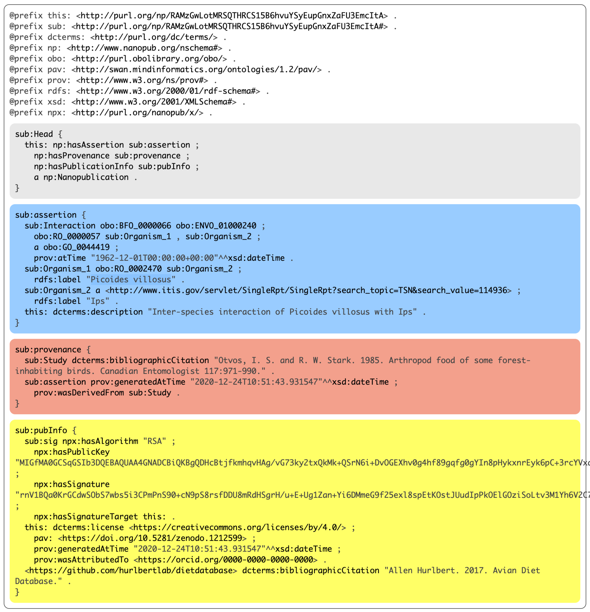

# Building the global knowledge graph: Nanopublishing with Python

Those familiar with the world of academic research will have heard the old maxim: publish or perish. 
Indeed, communicating the results of scientific research is arguably the most important function of a scientist. 
For academics, this almost always means traditional publishing in journals - lengthy and 
information-rich research articles written in a natural language such as English, 
with all the accompanying ambiguities and misunderstandings.

There are millions of papers published every year, which is far too many for a human to read or reason about. 
Information that could be useful to others must necessarily be lost by the wayside. 
There also exist many scientific results that are, despite being potentially useful to other researchers, 
not yet sufficient to warrant an entire research article. 
How do we formally communicate such findings such that they may be cited and credit attributed accordingly? 
One means of achieving this is to use 'nanopublications'.


## What are nanopublications?

Nanopublications are a formalized and machine-readable way of communicating the smallest possible units of publishable information. 
This could be, for example, the outcome of a scientific study or a claim made by a particular scientist. 
Crucially, they also specify the provenance of that information: Who said this? Where did that information come from?

The anatomy of a nanopublication are shown below:


As can be seen in this image, a nanopublication has three basic elements:
* Assertion: The assertion is the main content of a nanopublication in the form of a small atomic unit of information
* Provenance: This part describes how the assertion above came to be. This can include the scientific methods that were used to generate the assertion, for example a reference to the kind of study that was performed and its parameters.
* Publication Info: This part contains metadata about the nanopublication as a whole, such as when and by whom it was created and the license terms for its reuse.

### In what way are nanopublications machine-readable?
Nanopublications are made up of [Linked Data](https://en.wikipedia.org/wiki/Linked_data): 
structured data which is interlinked with other data so it becomes more useful through semantic queries.

This allows for doing queries like:
* Which species of insects were observed to be on the menu of 'Picoides villosus' (a type of bird)?
* Give me all nanopublications which describe historic events happening between 50 BC and 40 BC which mention Cleopatra VII. 

### An example nanopublication describing what is on a bird's menu
Here is an example nanopublication (which can be found [here](http://server.nanopubs.lod.labs.vu.nl/RAzquSkwsTAZm61nReG6MOjXEXUx8fNVfdWnAzyn6sOhU)):



You need to speak some [RDF](https://en.wikipedia.org/wiki/Resource_Description_Framework)
in order to understand this, but with a bit of imagination you could read that:
* The bird ('Picoides villosus') ate a beetle ('Ips')
* This inter-species interaction took place in [conifer woodland](http://www.ontobee.org/ontology/ENVO?iri=http://purl.obolibrary.org/obo/ENVO_01000240)
* This observation came from a paper published in 1985 by Otvos & Stark
* The information was extracted from the [dietdatabase](https://github.com/hurlbertlab/dietdatabase)

## How do I do that with python?

The ```nanopub``` library provides a high-level, user-friendly python interface for searching, publishing and retracting nanopublications. 
The development repository can be found [here ](https://github.com/fair-workflows/nanopub) with detailed documentation [here](https://nanopub.readthedocs.io/). 
```nanopub``` is available on the python package index, so setup should be as simple as typing:

```bash
pip install nanopub
```

In your python script, you can then set up the nanopub client:
```python
from nanopub import Publication, NanopubClient

client = NanopubClient()
```

The client carries out all searching, fetching, publishing, retraction etc of nanopublications from the servers.


For example, if you want to e.g. search for all nanopublications containing a particular text:

```python
# Search for all nanopublications containing the text 'fair'
results = client.find_nanopubs_with_text('fair')
print(results)
```
which returns a list of URIs and other information about the nanopublications found on the servers. 

You can then fetch a specific nanopublication directly using its URI:

```python
# Fetch the nanopublication at the specified URI
publication = client.fetch('http://purl.org/np/RApJG4fwj0szOMBMiYGmYvd5MCtRle6VbwkMJUb1SxxDM')

# Print the RDF contents of the nanopublication
print(publication)

# Iterate through all triples in the assertion graph
for s, p, o in publication.assertion:
    print(s, p, o)

```

## Hold on, I want to publish Nanopublications of my own!

To publish to the nanopub server you need to set up your profile. 
This allows the nanopub server to identify you. 
Run the following interactive command:

```bash
setup_profile
```

It will add and store RSA keys to sign your nanopublications, publish a nanopublication with your name and ORCID iD to
declare that you are using using these RSA keys, and store your ORCID iD to automatically add as author to the
provenance of any nanopublication you will publish using this library.


You can then publish a quick claim:
```python
client.claim('All cats are gray')
```

Or, to leverage the true power of semantic technologies, you can build your own RDF graph of triples and publish that:
```python
from rdflib import Graph, URIRef, RDF, FOAF

# 1. Construct a desired assertion (a graph of RDF triples)
my_assertion = Graph()
my_assertion.add( (URIRef('www.example.org/timbernerslee'), RDF.type, FOAF.Person) )

# 2. Make a Publication object with this assertion
publication = Publication.from_assertion(assertion_rdf=my_assertion)

# 3. Publish the Publication object. The URI at which it is published is returned.
publication_info = client.publish(publication)
print(publication_info)
```

## Conclusion
The python `nanopub` library provides a high-level, user-friendly python interface for the nanopub server,
making it easy to publish and search small scientific publications. 
