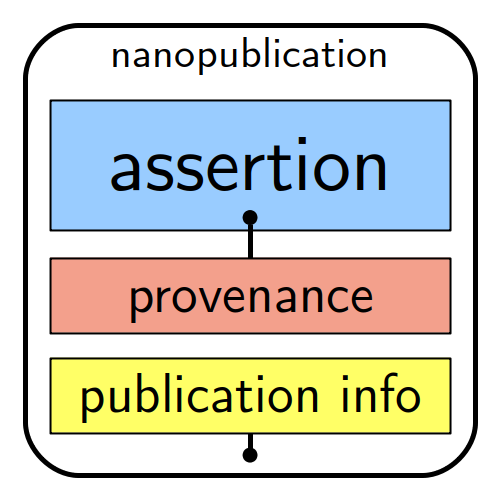

# What are nanopublications?
Nanopublications are a formalized and machine-readable way of communicating the smallest possible units
of publishable information. This could be, for example, the outcome of a scientific study or a claim
made by a particular scientist.

Nanopublications are searchable, citable, and contain authorship and attribution
information. The aim is to encourage individual scientific results to be released in a traceable and
interoperable format. As such, nanopublications are an effective [FAIR](https://www.go-fair.org/fair-principles/)
means of communicating scientific claims and results. Read more about them at [http://nanopub.org/](http://nanopub.org/).

## Different elements of a nanopublication
_From [nanopub.org](http://nanopub.org/wordpress/?page_id=65) documentation (2020/12/02)_

As can be seen in this image, a nanopublication has three basic elements:

1. Assertion: The assertion is the main content of a nanopublication
in the form of an small atomic unit of information
2. Provenance: This part describes how the assertion above came to be.
This can include the scientific methods that were used to generate the assertion,
for example a reference to the kind of study that was performed and its parameters.
3. Publication Info:  This part contains metadata about the nanopublication as a whole,
such as when and by whom it was created and the license terms for its reuse.
